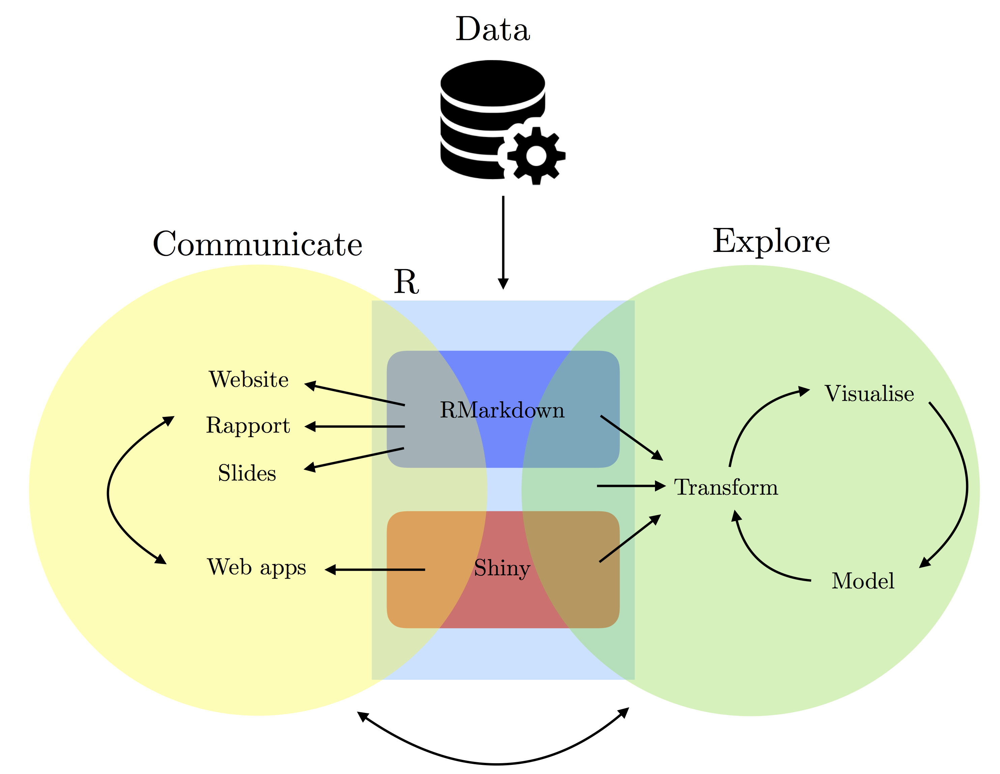

# Motivation

* "data science" hits ~3% of jobs on jobup.ch.
* More than 300 job offers for Switzerland on LinkedIn.
* "_Job applicants with computer skills are highly sought-after due to the increase of technology in the workplace._", [Indeed](https://www.indeed.com/career-advice/resumes-cover-letters/computer-skills), May 2022.

---
# Motivation 

* Computer skills help in solving problems.

<center><iframe width="640" height="480"
src="https://www.youtube.com/embed/Tzin1DgexlE">
</iframe></center>

---
# General goals

* introduce tools and workflows for reproducible research (R/RStudio, Git/GitHub, etc.); 
* introduce principles of tidy data and tools for data wrangling; 
* exploit data structures to appropriately manage data, computer memory and computations;
* data manipulation through controls, instructions, and tailored functions;
* develop new software tools including functions, Shiny applications, and packages;
* manage the software development process including version control, documentation (with embedded code), and dissemination for other users.

---
# General goals
```{r echo=FALSE, fig.align='center', out.width=593, out.height=459}

```

---
class: sydney-blue, center, middle
# Course logistic and expectation

---
# Course logistic and expectation
## Location and time
.pull-left[
.scroll-box-5[
```{r, echo = FALSE}
library(leaflet)
leaflet() %>% addTiles() %>% setView(6.58455, 46.52356, zoom = 17)
```
]]

.pull-right[
.scroll-box-5[
* Anthropole 3741
* Every Tuesday morning from 9 to 12. Either class or either practical.
* Verify the schedule on the course website.
]]

---
# Course logistic and expectation
## Material

* You need a laptop
* We work mainly with  and 
* All software we work with will be free for academic purposes

---
# Course logistic and expectation
## Requirements

* No IT background is assumed from the students but a strong will to learn useful and practical programming skills (Data Science in Business Analytics)
* Willing to work and collaborate in groups (4~6 people)
* Be ready to struggle with your computer!
<center></center>


---
# Course logistic and expectation
## Grading

* Learning outcomes will be assessed based on the performances within each of the following categories:

Type | Points | Bonus
:-- | :-- | :--
Semester project | 30 | 3
Homeworks | 30 | 3

* 4 homeworks in groups of 7.5 points (**penalty for late submission**).
* No final examination for this class.
* Final presentation of project last day of class (20th Dec).

---
# Course logistic and expectation
## Communication

* We use  to communicate and many more
* We use the **NEIN rule**! (No Email, only If Necessary)
* More info at [https://ptds.samorso.ch/](https://ptds.samorso.ch/)
* To access slack: register at [https://shiny.samorso.ch/fillingform/](https://shiny.samorso.ch/fillingform/) and wait your invitation 


---
class: sydney-blue, center, middle

# Question ?

.pull-down[
<a href="https://ptds.samorso.ch/">
.white[`r icons::fontawesome("file")` website]
</a>

<a href="https://github.com/ptds2021/">
.white[`r icons::fontawesome("github")` GitHub]
</a>
]
